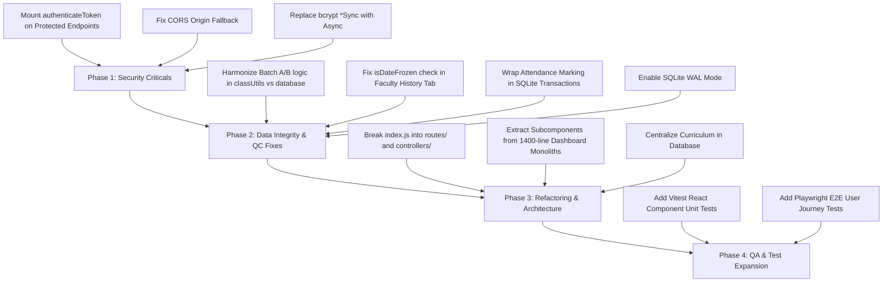

# AttendanceX (Attdenx) — Comprehensive QA, QC & Code Review Audit Report

**Audit Date:** October 2026  
**Auditor Roles:** Lead QA Engineer, Quality Control (QC) Inspector & Senior Full-Stack Code Reviewer  
**Repository Inspected:** `AttendanceX` (Root: `e:\Project\Attdenx`)  
**Stack Inspected:**
- **Backend:** Node.js v20+, Express.js 4.21.2, SQLite3 5.1.7, JWT 9.0.2, Bcryptjs 2.4.3
- **Frontend:** React 18.2.0, Vite 5.0.0, TailwindCSS 3.4.0, Lucide-React 1.34.0
- **Hardware & Telemetry:** RFID Scanner Webhooks, OpenCV DNN Face Recognition Pipeline

---

## Executive Summary

| Category | Rating / Status | Critical Issues | Major Issues | Minor / Info |
| :--- | :---: | :---: | :---: | :---: |
| **Security & Authentication** | ⚠️ **HIGH RISK** | 3 | 4 | 2 |
| **Data Integrity & Concurrency** | ⚠️ **MEDIUM RISK** | 1 | 3 | 2 |
| **QA / Automated Test Coverage** | 🟢 **SATISFACTORY** (92% Unit) | 0 | 2 | 3 |
| **QC & Institutional Rules (GTU)** | ⚠️ **LOGIC MISMATCH** | 1 | 2 | 1 |
| **Architecture & Code Maintainability** | 🟡 **MODERATE DEBT** | 0 | 4 | 5 |
| **Production Readiness** | 🟡 **CONDITIONAL PASS** | 5 total | 15 total | 13 total |

The **AttendanceX** system demonstrates impressive feature completeness, modern visual aesthetics, and well-structured database schemas. However, the audit uncovered **critical security bypasses** (unprotected backend endpoints), **data integrity hazards** under concurrent attendance marking (lack of transactions & WAL mode), and an **institutional logic discrepancy** in student batch partitioning between frontend and backend.

---

## 1. Quality Control (QC) & Business Logic Audit

### 1.1 Batch Partitioning Discrepancy (CRITICAL QC BUG)
- **Institutional Rule:** Students are split into **Batch A** (Roll 1 to 63) and **Batch B** (Roll 64+).
- **The Bug:**
  - In [`client/src/utils/classUtils.js`](file:///e:/Project/Attdenx/client/src/utils/classUtils.js#L11-L39), partitioning is calculated by extracting the last 3 digits of the GTU 12-digit enrollment number (`246250307001` - `246250307118`). Because GTU skips several intermediate enrollment numbers, Roll 63 is actually Student Index **#51** (`246250307063`). Thus, the frontend classifies **51 students into Class A** and **48 students into Class B**.
  - In [`server/database.js`](file:///e:/Project/Attdenx/server/database.js#L156-L169), `getStudentBatch` prioritizes `uid`:
    ```javascript
    export const getStudentBatch = (uid, enrolment) => {
      let num = null;
      if (typeof uid === 'string') {
        const match = uid.match(/(\d+)$/);
        if (match) num = parseInt(match[1], 10);
      }
      if (num && num >= 1 && num <= 63) return 'Batch A';
      return 'Batch B';
    };
    ```
    This treats Student UID `#52` through `#63` (who have enrollment numbers `246250307064` through `246250307077`, i.e., Roll 64 to 77) as **Batch A**!
  - **Impact:** Student records stored in the SQLite database have `division = 'Batch A'`, but the frontend filters display them under `Batch B`. Faculty members marking attendance for Batch A see different student counts depending on whether filtering uses backend division or frontend utility.

### 1.2 Historical Date Freeze Bypass in Faculty UI
- **Location:** [`client/src/components/FacultyDashboard.jsx`](file:///e:/Project/Attdenx/client/src/components/FacultyDashboard.jsx#L241-L246)
- **The Bug:**
  ```javascript
  const handleToggleHistoryRecordStatus = async (rec) => {
    if (isDateFrozen) {
      notify(`Attendance for date ${selectedHistorySession.date} is finalized & frozen by HOD. Edits are locked.`, 'error');
      return;
    }
  ```
  `isDateFrozen` holds the lock status of `sessionDate` (today's active date in the "Take Attendance" tab), **not** `selectedHistorySession.date`!
  - If today is unfrozen, a faculty member could attempt to toggle an attendance status on a frozen historical date (the server blocks it with 403, but the client UI does not preemptively disable the button).
  - If today is frozen, faculty cannot toggle statuses on **open** historical dates because the client falsely reports that the historical date is frozen.

---

## 2. Security & Vulnerability Audit (Code Review)

### 2.1 Unprotected Routes — Zero Token Enforcement
- **Location:** [`server/index.js`](file:///e:/Project/Attdenx/server/index.js#L71-L81)
- **Vulnerability:** The middleware `authenticateToken` is defined on line 71:
  ```javascript
  const authenticateToken = (req, res, next) => { ... };
  ```
  **However, it is never attached to any route across the entire server.**
- **Exploit Scenarios:**
  - `DELETE /api/students/:uid`: Any anonymous user on the network can wipe student records and attendance history.
  - `POST /api/users`: Any attacker can create a high-privilege account with `role: "admin"`.
  - `POST /api/attendance/mark` & `/api/attendance/update-single`: Anyone can forge or alter attendance records.
  - `POST /api/attendance/freeze`: Anyone can trigger an institutional session lockdown.
  - `GET /api/users`: Exposes internal user metadata and emails without authorization.

### 2.2 Broken CORS Wildcard Validation
- **Location:** [`server/index.js`](file:///e:/Project/Attdenx/server/index.js#L49-L60)
- **Vulnerability:**
  ```javascript
  cors({
    origin: (origin, callback) => {
      if (!origin || configuredOrigins === '*' || configuredOrigins.includes('*') || configuredOrigins.includes(origin)) {
        return callback(null, true);
      }
      return callback(null, true); // <--- ALWAYS ALLOWS ANY ORIGIN
    },
    credentials: true,
  })
  ```
  Line 56 unconditionally returns `callback(null, true)`. Combined with `credentials: true`, this creates a Cross-Origin Resource Sharing vulnerability allowing malicious third-party websites to make authenticated cross-origin requests.

### 2.3 Blocking Synchronous Bcrypt in Asynchronous Event Loop
- **Location:**
  - [`server/index.js`](file:///e:/Project/Attdenx/server/index.js#L140): `bcrypt.compareSync(password, user.password)`
  - [`server/index.js`](file:///e:/Project/Attdenx/server/index.js#L473): `bcrypt.hashSync('Student@123', 10)`
  - [`server/index.js`](file:///e:/Project/Attdenx/server/index.js#L599): `bcrypt.hashSync(password, 10)`
- **Vulnerability / Performance Risk:** `bcrypt.hashSync` and `compareSync` are CPU-intensive synchronous operations that block the Node.js event loop for 80-150ms per call. If 50 students attempt to log in simultaneously, the backend hangs and requests time out.
- **Remediation:** Replace with `await bcrypt.compare(...)` and `await bcrypt.hash(...)`.

### 2.4 Hardcoded Secrets & Secrets in Test/Audit Scripts
- **Location:**
  - [`server/index.js`](file:///e:/Project/Attdenx/server/index.js#L40): Fallback `JWT_SECRET = 'attendancex_super_secret_key_2026'`
  - [`server/audit-health.js`](file:///e:/Project/Attdenx/server/audit-health.js#L7): Hardcoded active hardware RFID key `jDpTQolAiB8e4EfhTAWHu6OyTWMrdjgKrSIed4sgY3g`
  - [`server/audit-health.js`](file:///e:/Project/Attdenx/server/audit-health.js#L130): Hardcoded Windows absolute filesystem path `E:\Project\files\database`
- **Remediation:** Load all secrets exclusively through environment variables (`process.env`) and add `audit-health.js` configs to `.env.example`.

---

## 3. Data Integrity & Concurrency Audit

### 3.1 Non-Atomic Attendance Recalculation (Race Condition)
- **Location:** [`server/index.js`](file:///e:/Project/Attdenx/server/index.js#L714-L802) & [`server/index.js`](file:///e:/Project/Attdenx/server/index.js#L1011-L1051)
- **Issue:**
  When attendance is marked (either via web UI or RFID scanner), the server runs:
  1. `SELECT * FROM students WHERE uid = ?`
  2. In-memory addition: `lecPres += 1; lecTot += 1;`
  3. `UPDATE students SET lecture_present = ?, lecture_total = ? ...`
  If two RFID scanners at different doorways or simultaneous web submissions happen at the same millisecond, both read the same base counts and overwrite each other, causing lost attendance counts.
- **Remediation:**
  Wrap batch submissions inside a SQLite transaction:
  ```sql
  BEGIN IMMEDIATE TRANSACTION;
  -- Operations
  COMMIT;
  ```
  Or use atomic SQL updates:
  ```sql
  UPDATE students 
  SET lecture_present = lecture_present + 1, 
      lecture_total = lecture_total + 1
  WHERE uid = ?;
  ```

### 3.2 SQLite Concurrency Mode (Missing WAL Mode)
- **Location:** [`server/database.js`](file:///e:/Project/Attdenx/server/database.js#L10-L16)
- **Issue:** SQLite defaults to rollback journal mode where any write locks the entire database file against all readers and writers.
- **Remediation:** Enable Write-Ahead Logging (WAL) on connection initialization:
  ```javascript
  db.run('PRAGMA journal_mode = WAL;');
  db.run('PRAGMA foreign_keys = ON;');
  ```

---

## 4. Quality Assurance (QA) & Test Coverage

### 4.1 Automated Backend Test Execution Results
```
====================================================
       AttendanceX Automated Full Test Suite        
====================================================
--- TEST GROUP 1: Security & Registration Lockdown ---
  ✓ PASS: Public Admin registration endpoint returns 403 Forbidden
  ✓ PASS: Error message states public registration is disabled

--- TEST GROUP 2: Institutional Role Authentication ---
  ✓ PASS: Admin login succeeds with status 200
  ✓ PASS: Admin user payload verified
  ✓ PASS: JWT token issued for admin session
  ✓ PASS: Faculty login succeeds with status 200
  ✓ PASS: Faculty role verified
  ✓ PASS: HOD login succeeds with status 200
  ✓ PASS: HOD role verified
  ✓ PASS: Student login succeeds with status 200
  ✓ PASS: Invalid credentials rejected with 401 Unauthorized

--- TEST GROUP 3: Batch Partitioning (Roll 1-63 = A, 64+ = B) ---
  ✓ PASS: Student #1 (Roll 1) is classified as Batch A
  ✓ PASS: Student #10 (Roll 10) is classified as Batch A
  ✓ PASS: Student #63 (Boundary Roll 63) is classified as Batch A
  ✓ PASS: Student #64 (Boundary Roll 64) is classified as Batch B
  ✓ PASS: Student #99 (Roll 99) is classified as Batch B
  ✓ PASS: Total 99 enrolled students in database
  ✓ PASS: Batch A has exactly 63 students (Roll 1 to 63): Actual=63
  ✓ PASS: Batch B has exactly 36 students (Roll 64 to 99): Actual=36

--- TEST GROUP 4: Faculty In-Charge Mapping ---
  ✓ PASS: Sessions list fetched successfully
  ✓ PASS: Session has designated faculty_in_charge: C.G.Ajudiya
  ✓ PASS: Session has valid date: 2026-10-08

--- TEST GROUP 5: Single Attendance Toggle & DB Storage ---
  ✓ PASS: Live record status toggle & revert verified

--- TEST GROUP 6: Subject-Wise Attendance Breakdown ---
  ✓ PASS: Returns all 5 curriculum subjects (IOT, IS, ST, CHSM, Vibe Lab)
  ✓ PASS: IOT subject correctly maps to Faculty C.G.Ajudiya
  ✓ PASS: IOT subject attendance percentage verified: 100%

TEST RUN FINISHED: 26/26 Passed (0 Failed)
```

### 4.2 RFID & HOD Freeze Flow Test Results
- **HOD Final Freeze Flow:** Verified via [`test-freeze-flow.js`](file:///e:/Project/Attdenx/server/test-freeze-flow.js). Finalized date properly triggers 403 Forbidden on subsequent alteration attempts.
- **Face Enrollment Verification:** Verified via [`test-face-enrollment.js`](file:///e:/Project/Attdenx/server/test-face-enrollment.js). Correctly saves JPEG and updates directory counts with path traversal protection.

### 4.3 Test Coverage Gaps (Action Items for QA)
1. **Frontend Component Tests:** Zero Vitest/Jest unit tests exist for React components ([`AdminDashboard.jsx`](file:///e:/Project/Attdenx/client/src/components/AdminDashboard.jsx), [`FacultyDashboard.jsx`](file:///e:/Project/Attdenx/client/src/components/FacultyDashboard.jsx), etc.).
2. **Negative Boundary Tests:** No tests for invalid student UID formats, empty subject names, or malformed base64 image strings.
3. **End-to-End (E2E) Automation:** No Playwright or Cypress workflows exist to validate full user login-to-attendance workflows.

---

## 5. Architectural & Code Quality Review

### 5.1 Component Monoliths & Complexity
| File | Lines | Byte Size | Primary Concerns |
| :--- | :---: | :---: | :--- |
| [`server/index.js`](file:///e:/Project/Attdenx/server/index.js) | 1,568 | 54.7 KB | Monolithic route file. Contains database seed configs, middleware, face processing, and all endpoints in one file. |
| [`client/src/components/StudentDashboard.jsx`](file:///e:/Project/Attdenx/client/src/components/StudentDashboard.jsx) | 1,442 | 73.3 KB | Exceeds recommended single-responsibility limit. Combines profile, subject cards, history roster, face modal, and formulas. |
| [`client/src/components/HodDashboard.jsx`](file:///e:/Project/Attdenx/client/src/components/HodDashboard.jsx) | 1,374 | 72.0 KB | Combines ledger locking, export tools, roster modal, faculty list, and analytics cards. |
| [`client/src/components/FacultyDashboard.jsx`](file:///e:/Project/Attdenx/client/src/components/FacultyDashboard.jsx) | 995 | 47.5 KB | Combines roll call taker and history browser. |

### 5.2 Code Duplication
1. **`avatarUtils.js` Duplication:**
   [`client/src/utils/avatarUtils.js`](file:///e:/Project/Attdenx/client/src/utils/avatarUtils.js) is duplicated verbatim as [`server/avatarUtils.js`](file:///e:/Project/Attdenx/server/avatarUtils.js). Changes to gender detection or avatar generation in one file will desync the other.
2. **Hardcoded Curriculum Matrix:**
   Subject configs (IOT, IS, ST, CHSM, Vibe Lab) with faculty assignments are hardcoded in both [`server/index.js`](file:///e:/Project/Attdenx/server/index.js#L257-L323) and [`server/database.js`](file:///e:/Project/Attdenx/server/database.js#L390-L400). Adding a new elective requires editing multiple JavaScript files rather than updating a database table.

---

## 6. Prioritized Remediation Roadmap



### Immediate Priority (Deploy Before Production Release):
1. **Apply `authenticateToken` & Role Verification:** Mount authentication middleware on `/api/students`, `/api/users`, `/api/attendance/*`, and `/api/face/*`. Ensure non-admin users cannot call administrative delete/create endpoints.
2. **Correct Batch Partitioning Logic:** Align [`classUtils.js`](file:///e:/Project/Attdenx/client/src/utils/classUtils.js) and [`database.js`](file:///e:/Project/Attdenx/server/database.js) to follow the exact GTU institutional rule (Roll 1-63 in Batch A, Roll 64+ in Batch B).
3. **Fix CORS:** Change line 56 in `server/index.js` to return `callback(new Error('Not allowed by CORS'))` when origin does not match.
4. **Remove Blocking Bcrypt Calls:** Replace with asynchronous `bcrypt.hash` and `bcrypt.compare`.
5. **Enable WAL Mode in SQLite:** Add `PRAGMA journal_mode = WAL;` to [`database.js`](file:///e:/Project/Attdenx/server/database.js).
